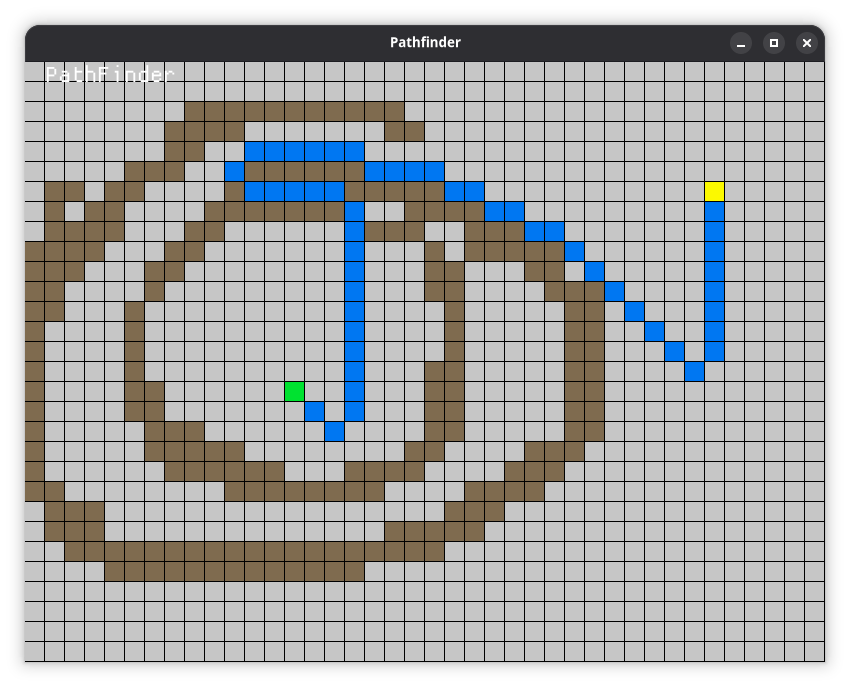
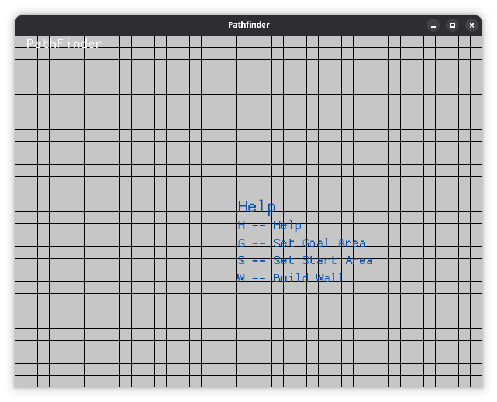

# PathFinder

PathFinder is my attempt to create a pathfinding app in my favorite programing language.

## Usage

Press H for help

on linux run
`release/pathfinder`
or build from source
`cargo build`
Press and hold corresponding letter and drag or click to set

W - Create walls
H - Help
S - Set start cell
G - Set end goal

Space - Solve with a* algorithm

## Bugs
- Multiple start and end goals can be set

## Future Additions
- Step by step solving
- Better UI
- Better controls
- Customizing colors
- Customizing grid size
and many more

